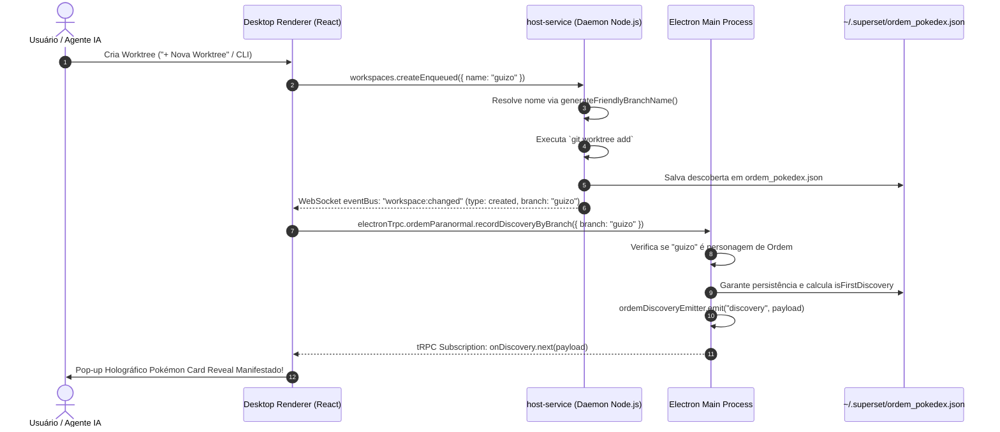

# Especificação de Produto e Arquitetura: Pokédex de Ordem Paranormal
**Projeto:** Superset Desktop IDE — Arquivo Paranormal da Ordo Realitas  
**Data:** 21 de Setembro de 2026  
**Status:** Aprovado / Especificação Oficial  
**Autores:** Equipe de Engenharia e Produto Superset  

---

## 1. Visão Geral & Proposta de Valor

A **Pokédex de Ordem Paranormal** (intitulada internamente como **Arquivo Paranormal da Ordo Realitas**) é uma funcionalidade de gamificação e personalização integrada ao fluxo de desenvolvimento do Superset.

No desenvolvimento de software moderno com o Superset, engenheiros e agentes criam dezenas de *git worktrees* diariamente para isolar tarefas, testar hipóteses e conduzir sessões de pair-programming com agentes de IA. Em vez de utilizar nomes genéricos de branches (como `branch-1`, `temp-fix`, etc.), o Superset batiza cada worktree com o nome de um personagem, criatura ou relíquia do universo de **Ordem Paranormal RPG** (criado por Cellbit).

Cada nova worktree criada desbloqueia um card colecionável permanente no perfil do usuário, exibindo um card holográfico estilo *Pokémon Trading Card Game (TCG)* com efeitos visuais de foil 3D, reflexos de luz e trilha de descoberta em tempo real.

```
┌─────────────────────────────────────────────────────────────────────────────┐
│                             FLUXO DO USUÁRIO                                │
│                                                                             │
│  1. Cria Worktree (UI / CLI / Agente)                                       │
│      └─► Nome sorteado: "guizo"                                             │
│                                                                             │
│  2. Pop-up Holográfico Efeito Pokémon TCG no canto da tela                  │
│      └─► "★ NOVA DESCOBERTA ★ — Guizo (Energia) VD 100"                      │
│                                                                             │
│  3. Card desbloqueado na Pokédex Global (~/.superset/ordem_pokedex.json)   │
│      └─► Progresso: 14/35 Descobertos (40%)                                 │
│                                                                             │
│  4. Acesso ao Arquivo Paranormal                                            │
│      └─► Visualização de cards, lore oficial, histórico de worktrees         │
└─────────────────────────────────────────────────────────────────────────────┘
```

---

## 2. Personas & Jornadas do Usuário

### 2.1. O Desenvolvedor Explorador
- **Objetivo:** Trabalha no dia a dia no Superset criando worktrees para features e bugs.
- **Experiência:** É surpreendido positivamente quando uma nova worktree é criada e um card holográfico sobe com animação no canto inferior direito da tela, celebrando a descoberta de uma entidade rara como o *Deus da Morte* ou *Arthur Cervero*.

### 2.2. O Colecionador Convicto
- **Objetivo:** Completar 100% da Pokédex Paranormal.
- **Experiência:** Acessa a página da Pokédex pelo rodapé da barra lateral ou pelo menu de configurações, visualiza cards já desbloqueados com fotos e citações, inspeciona cards ainda confidenciais marcados como `[CLASSIFICADO]` com dicas de como manifestá-los, e filtra por Elemento do Outro Lado (Sangue, Morte, Conhecimento, Energia, Medo).

### 2.3. O Fã de RPG e Lore
- **Objetivo:** Conectar o ambiente de trabalho às narrativas da Ordo Realitas.
- **Experiência:** Ao clicar em um card, abre o dossiê confidencial detalhado, lê a biografia, a temporada de origem, a habilidade/classe, o Nível de Dificuldade (VD) e vê a lista cronológica de branches e projetos em que aquele personagem já atuou no seu computador.

---

## 3. Requisitos de Produto & Escopo

### 3.1. Requisitos Globais (Invariantes)
1. **Escopo Global do Usuário (Multi-Organização):**
   - A Pokédex pertence ao **usuário da máquina**, não a uma organização ou workspace individual do Superset.
   - Worktrees criadas na Organização A (ex: trabalho) e Organização B (ex: projetos pessoais) compartilham o mesmo catálogo e histórico permanente.
   - O arquivo de persistência é salvo em `$SUPERSET_HOME_DIR/ordem_pokedex.json` (padrão: `~/.superset/ordem_pokedex.json`).

2. **Histórico Permanente de Descoberta:**
   - Deletar uma worktree no Git ou fechar um projeto **nunca** apaga o personagem da Pokédex.
   - Apenas o status de *presença ativa* (`isActiveNow`) é atualizado para refletir se a worktree ainda existe no repositório.

3. **Compatibilidade com Convenções do Monorepo Superset:**
   - Componentes React organizados em pastas dedicadas (`ComponentName/ComponentName.tsx` + `index.ts`).
   - Co-locação de testes unitários (`.test.tsx` / `.test.ts`).
   - Internacionalização via Lingui com macros `<Trans>` ou `msg`.
   - Compatibilidade total com o tema escuro/claro e paleta do Tailwind.

---

## 4. Arquitetura da Interface da Pokédex (`/settings/pokedex`)

### 4.1. Estrutura de Rotas e Pontos de Entrada
A página da Pokédex possui dois pontos de entrada acessíveis:
1. **Configurações:** Rota `/_authenticated/settings/pokedex` (aba nas configurações do aplicativo).
2. **Atalho Direto:** Rota `/_authenticated/pokedex` (redireciona para a aba de configurações).
3. **Barra Lateral do IDE:** Ícone de escudo (Ordo Realitas) posicionado no rodapé da barra lateral de workspaces (`WorkspaceSidebarFooter.tsx`).
4. **Command Palette (`Cmd+K`):** Comandos com busca fuzzy para palavras-chave como `pokedex`, `ordem paranormal`, `personagens`, `entidades`, `cartas`.

---

### 4.2. Header & Painel de Progresso

```
┌─────────────────────────────────────────────────────────────────────────────────────────────────────────┐
│ [🛡️ Brasão Ordo Realitas]  ARQUIVO PARANORMAL DA ORDO REALITAS                    [✨ Testar Carta Pokémon] │
│ Registro confidencial de agentes, criaturas e relíquias do Outro Lado vinculadas a worktrees             │
├─────────────────────────────────────────────────────────────────────────────────────────────────────────┤
│ PROGRESSO DE MANIFESTAÇÃO                                                                               │
│ [████████████████████████████████░░░░░░░░░░░░░░░░░░░░░░░░░░░░░░░░░░░░░░░░░░]  14 / 35 DESCOBERTOS (40%) │
│                                                                                                         │
│ 🟢 3 Worktrees Ativas Agora  •  🔥 8 Sangue  •  ⏳ 6 Morte  •  🧠 7 Conhecimento  •  ⚡ 9 Energia  •  👁️ 5 Medo │
├─────────────────────────────────────────────────────────────────────────────────────────────────────────┤
│ [🔍 Buscar personagem, criatura ou frase...]   [Todos | Personagens | Criaturas | Relíquias]            │
│ [Elementos: Todos | 🩸 Sangue | ⏳ Morte | 📜 Conhecimento | ⚡ Energia | 👁️ Medo]                       │
└─────────────────────────────────────────────────────────────────────────────────────────────────────────┘
```

#### Elementos do Header:
1. **Identidade Visual da Ordo Realitas:** Tipografia austera, monospace para metadados, brasão estilizado e texto descritivo oficial.
2. **Barra de Progresso Dinâmica:**
   - Contador de descobertas: `${totalDiscovered} / ${totalCharacters}`.
   - Percentual de conclusão com preenchimento com gradiente temático.
   - Indicador em tempo real de quantas worktrees correspondentes estão ativas no Git local no momento.
3. **Barra de Ferramentas e Filtros:**
   - Campo de busca instantânea (filtra por nome, categoria, elemento, papel ou citação).
   - Botões de alternância de Categoria: *Todos*, *Personagens*, *Criaturas*, *Relíquias*.
   - Pílulas de Elemento: *Sangue* (vermelho), *Morte* (cinza/preto), *Conhecimento* (dourado/âmbar), *Energia* (roxo/magenta), *Medo* (ciano/azul espectral).
   - Botão **`✨ Testar Carta Pokémon`**: aciona imediatamente o pop-up de revelação com animação para testes e demonstração.

---

### 4.3. Grid de Cards Colecionáveis

O corpo principal da página exibe um grid responsivo (2 colunas em telas menores, até 5 colunas em monitores ultra-wide) com dois estados distintos de visualização:

#### A. Card Descoberto (Desbloqueado)
- **Moldura com Tema Elemental:** Borda e brilho sutil na cor do Elemento associado (Sangue, Morte, Conhecimento, Energia, Medo).
- **Foto/Ilustração Oficial:** Arte canônica do personagem/criatura com máscara de gradiente e suporte a fallback gracioso caso a imagem externa falhe.
- **Cabeçalho do Card:**
  - Nome oficial em destaque negrito.
  - Badge estilizado do Elemento com ícone e cor característica.
- **Selo de Categoria e Temporada:** Pílula translúcida indicando a saga (ex: *Desconjuração*, *Calamidade*, *O Segredo na Floresta*).
- **Habilidade / Ocupação:** Papel na ordem (ex: *Marcado / Ocultista*, *Combatente Especialista*, *Monstruosidade de Sangue*).
- **Citação Marcante:** Frase icônica em itálico entre aspas.
- **Badge de Status de Presença Ativa:**
  - Se estiver em uso em uma worktree no momento: Pílula verde pulsante `🟢 Em Uso: feat/guizo`.
  - Se for histórica: Pílula discreta `Discoberto em 19/09/2026 • 3x Usado`.
- **Efeito Holográfico ao Passar o Mouse (Hover 3D Tilt):** Leve inclinação 3D (`perspective` + `rotateX`/`rotateY`) com reflexo de luz dinâmico atravessando a carta.

#### B. Card Não Descoberto (`[CLASSIFICADO]`)
- **Visual Confidencial:** Fundo escurecido com textura de arquivo sigiloso da Ordo Realitas.
- **Silhueta Enigmática:** Ícone de interrogação elemental ou silhueta estilizada.
- **Título:** `[DOCUMENTO CLASSIFICADO]`.
- **Dica de Desbloqueio (Teaser):** Texto misterioso dando pista de qual entidade se oculta ali (ex: *"Uma entidade voraz das profundezas de Santo Berço aguarda uma nova worktree..."*).
- **Elemento Presumido:** Borda sutil na cor do elemento para guiar o colecionador.

---

### 4.4. Modal de Dossiê Detalhado (`PokedexDetailModal`)

Ao clicar sobre um card descoberto, abre-se um modal cinematográfico em tela cheia/centralizado:

```
┌────────────────────────────────────────────────────────────────────────────────────────┐
│ 🗄️ DOSSIÊ ORDO REALITAS: REF-SANGUE-001                                            [✕] │
├──────────────────────────────────────┬─────────────────────────────────────────────────┤
│                                      │ ARTHUR CERVERO                                  │
│                                      │ "O que importa não é como você cai, mas como    │
│  [ FOTO EM ALTA RESOLUÇÃO ]          │  você levanta."                                 │
│                                      │                                                 │
│  Elemento: SANGUE                    │ Classe / Papel: Combatente de Elite             │
│  Categoria: Personagem               │ Temporada: O Segredo na Floresta / Desconjuração │
│  Nível de Dificuldade: VD 100        │ Primeira Manifestação: 19/09/2026 15:30         │
│                                      ├─────────────────────────────────────────────────┤
│                                      │ BIOGRAFIA ARQUIVADA                             │
│                                      │ Membro veterano dos Marcados e líder de campo.  │
│                                      │ Especialista em combate armado e resistência    │
│                                      │ sobrenatural contra as forças da Morte e Medo...│
│                                      ├─────────────────────────────────────────────────┤
│                                      │ HISTÓRICO DE WORKTREES VINCULADAS (3 aparições) │
│                                      │ • branch: `arthur-cervero` (Projeto: core-api)  │
│                                      │ • branch: `feat/arthur-cervero-fix` (Projeto:..)│
└──────────────────────────────────────┴─────────────────────────────────────────────────┘
```

#### Conteúdo do Dossiê:
1. **Fotografia Ampliada:** Exibição detalhada com moldura holográfica elemental.
2. **Dados Oficiais de Ficha de RPG:**
   - Elemento primordial com descrição filosófica do elemento.
   - Nível de Ameaça / VD (Valor de Dificuldade).
   - Ocupação e afiliação dentro da Ordem.
3. **Lore Completa:** Biografia canônica oficial do RPG.
4. **Log de Utilização Real do Desenvolvedor:** Lista completa de todas as branches, projetos e timestamps em que o desenvolvedor invocou aquele personagem em sua máquina de trabalho.

---

## 5. Sistema de Notificação: Pop-up Holográfico Estilo Pokémon TCG

Quando o usuário cria uma worktree (via modal `+ Nova Worktree`, via linha de comando ou via IA), o componente [`OrdemPokemonCardReveal`](file:///Users/luizsantos/.superset/worktrees/c5e5b895-0baf-465d-bf9e-c68286d2f714/abundant-geranium/apps/desktop/src/renderer/routes/_authenticated/components/OrdemPokemonCardReveal/OrdemPokemonCardReveal.tsx) é acionado:

### 5.1. Coreografia da Revelação:
1. **Entrada Suave (Slide & Fade):** Desliza a partir do canto inferior direito com rotação suave de `-1deg`.
2. **Efeito Holográfico Shimmer:** Camada de gradiente em ângulo de 115° com mistura de cor `color-dodge`, animando continuamente um reflexo prismático nas cores do elemento e do arco-íris de folha metálica.
3. **Banner Superior:** 
   - Se for a primeira descoberta: `★ NOVA DESCOBERTA ★` com estrelas cintilantes e brilho âmbar.
   - Se for uma reutilização: `ENTIDADE MANIFESTADA`.
4. **Selo de VD (Valor de Dificuldade):** Exibe a pontuação de VD no canto superior direito como nos cards Pokémon (ex: *HP 120* -> *VD 100*).
5. **Ações do Pop-up:**
   - Botão **"Abrir no Arquivo 📜"**: Leva o desenvolvedor diretamente à página do Pokédex, focando na entidade recém-descoberta.
   - Botão **"Guardar"** ou `✕`: Fecha o pop-up imediatamente.
   - **Auto-Dismiss:** Desaparece suavemente após 12 segundos se não houver interação.

---

## 6. Arquitetura Técnica & Fluxo de Dados

### 6.1. Diagrama de Sequência Entre Processos

Como o Superset opera em múltiplos processos (Daemon `host-service`, Processo Principal `Electron Main`, e Janela `Renderer`), o fluxo de eventos é arquitetado para garantir zero perda de sincronia:



---

### 6.2. Modelagem dos Dados (Schemas Zod & TypeScript)

#### A. Catálogo de Personagens ([`types.ts`](file:///Users/luizsantos/.superset/worktrees/c5e5b895-0baf-465d-bf9e-c68286d2f714/abundant-geranium/packages/shared/src/ordem-paranormal/types.ts))
```typescript
export const ordemElementSchema = z.enum([
  "Sangue",
  "Morte",
  "Conhecimento",
  "Energia",
  "Medo",
  "Nenhum",
]);

export const ordemCategorySchema = z.enum([
  "personagem",
  "criatura",
  "reliquia",
]);

export const ordemCharacterSchema = z.object({
  id: z.string(),              // ex: "arthur-cervero", "guizo"
  name: z.string(),            // ex: "Arthur Cervero"
  category: ordemCategorySchema,
  element: ordemElementSchema,
  season: z.string(),          // ex: "O Segredo na Floresta"
  role: z.string(),            // ex: "Combatente / Marcado"
  description: z.string(),     // Biografia oficial
  imageUrl: z.string().url(),  // Link oficial da Wiki / CDN
  quote: z.string().optional(),// Frase marcante
});
```

#### B. Registro de Descoberta Permanente ([`storage.ts`](file:///Users/luizsantos/.superset/worktrees/c5e5b895-0baf-465d-bf9e-c68286d2f714/abundant-geranium/packages/shared/src/ordem-paranormal/storage.ts))
```typescript
export interface OrdemAppearance {
  branch: string;
  project?: string;
  org?: string;
  discoveredAt: string; // ISO 8601
}

export interface OrdemPokedexEntry {
  slug: string;
  firstDiscoveredAt: string;
  lastSeenAt: string;
  timesUsed: number;
  appearances: OrdemAppearance[];
}

export interface OrdemPokedexData {
  version: 1;
  entries: Record<string, OrdemPokedexEntry>;
}

export interface OrdemPokedexSummary {
  totalCharacters: number;
  totalDiscovered: number;
  discoveryPercentage: number;
  cards: OrdemPokedexCardData[];
}
```

---

### 6.3. Rotas da API tRPC Desktop ([`ordem-paranormal.ts`](file:///Users/luizsantos/.superset/worktrees/c5e5b895-0baf-465d-bf9e-c68286d2f714/abundant-geranium/apps/desktop/src/lib/trpc/routers/ordem-paranormal.ts))

| Procedure | Tipo | Entrada | Descrição |
|---|---|---|---|
| `getSummary` | Query | Nenhuma | Retorna estatísticas gerais, percentual e lista de todos os cards com status de descoberta e branches ativas. |
| `getCharacter` | Query | `{ id: string }` | Retorna o dossiê detalhado de um personagem individual. |
| `recordDiscoveryByBranch` | Mutation | `{ branch: string, project?: string, org?: string }` | Identifica a entidade a partir do nome da worktree, atualiza a Pokédex e transmite o evento em tempo real. |
| `onDiscovery` | Subscription | Nenhuma | Stream reativo (Observable) escutado pelo componente `OrdemPokemonCardReveal`. |
| `triggerTestReveal` | Mutation | `{ characterId?: string }` | Dispara intencionalmente uma revelação para teste visual na interface. |

---

## 7. Especificação Visual & Temas Elementais

Cada elemento de Ordem Paranormal possui uma assinatura estética única aplicada aos cards, badges e partículas:

| Elemento | Conceito & Filosofia | Cor Principal | Gradiente do Card | Borda & Glow |
|---|---|---|---|---|
| **🩸 Sangue** | Paixão, dor, fúria e intensidade biológica | Vermelho Rubro (`#ef4444`) | `from-red-950 via-zinc-950 to-neutral-950` | `border-red-500/70` `shadow-red-500/40` |
| **⏳ Morte** | Tempo, decomposição, cinzas e inevitabilidade | Cinza Asfalto / Preto (`#a1a1aa`) | `from-neutral-900 via-zinc-950 to-black` | `border-neutral-400/60` `shadow-neutral-400/30` |
| **📜 Conhecimento** | Sigilos, verdades proibidas, ouro e lógica | Âmbar Dourado (`#f59e0b`) | `from-amber-950 via-zinc-950 to-neutral-950` | `border-amber-400/70` `shadow-amber-500/40` |
| **⚡ Energia** | Eletricidade, caos, transformação e imprevisibilidade | Púrpura Elétrico (`#a855f7`) | `from-purple-950 via-zinc-950 to-neutral-950` | `border-purple-500/70` `shadow-purple-500/40` |
| **👁️ Medo** | O desconhecido, o infinito e a ruptura da realidade | Ciano Espectral (`#38bdf8`) | `from-sky-950 via-zinc-950 to-neutral-950` | `border-sky-400/70` `shadow-sky-400/40` |

---

## 8. Tratamento de Casos de Borda & Resiliência

1. **Falha de Carregamento de Imagens Externas (Hotlink / 403 / Offline):**
   - Imagens hospedadas em wikis externas (Fandom) podem falhar ou ser bloqueadas por CDN.
   - **Regra de Implementação:** Todo componente com `` implementa handler `onError={() => setImageError(true)}` exibindo um selo sigilar com o glifo do Elemento e o nome do personagem, garantindo que o card nunca fique quebrado.

2. **Criação Rápida de Múltiplas Worktrees (Debounce de Eventos):**
   - Criações em lote ou requisições paralelas poderiam poluir a tela com dezenas de pop-ups simultâneos.
   - **Solução Implementada:** Janela de debounce de 15 segundos por branch no `storage.ts`, impedindo duplicidade de emissão para a mesma worktree.

3. **Branch Não Correspondente (Ex: `main`, `master`, `hotfix/123`):**
   - O método `recordDiscoveryByBranch` realiza busca segura (`findCharacterByBranch`). Se o branch for um nome genérico fora do universo de Ordem, retorna `null` de forma silenciosa sem emitir erro ou poluir os logs.

4. **Persistência em Ambientes Restritos:**
   - Em caso de falha de permissão de escrita em disco, o sistema captura a exceção graciosamente, preservando a sessão em memória sem quebrar a criação da worktree.

---

## 9. Próximos Passos & Melhorias Futuras (Roadmap)

1. **Efeitos Sonoros Opcionais (SFX Paranormal):**
   - Efeito de farfalhar de páginas antigas ao abrir a Pokédex.
   - Sussurro etéreo na manifestação de cartas de Medo ou Relíquias.
2. **Relíquias do Calamidade (Edição Holográfica Ultra-Rara):**
   - Animação rainbow foil exclusiva para as 4 relíquias supremas (*Coração de Sangue*, *Máscara do Desespero*, *Relógio de Arnaldo*, *Anfitrião*).
3. **Evolução de VD (Valor de Dificuldade):**
   - Cards ganham "experiência" (aumento de VD) conforme o desenvolvedor realiza commits e merges na respectiva worktree.
4. **Compartilhamento de Coleção:**
   - Botão para exportar card como imagem PNG estilizada ou compartilhar no Slack / Discord da equipe.

---

*Documento mantido pela equipe de engenharia do Superset. Para dúvidas ou extensões do catálogo, consulte a skill em `.agents/skills/ordem-paranormal/SKILL.md`.*
